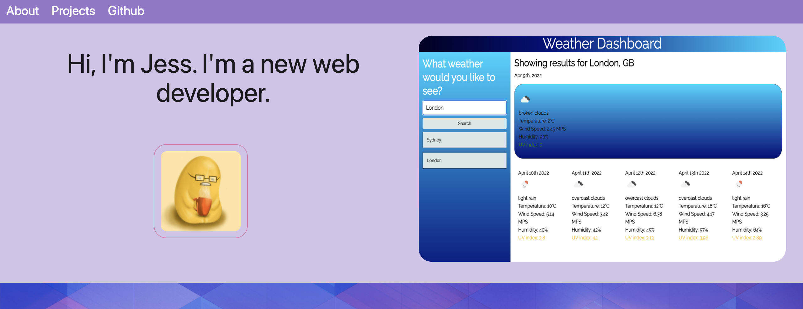
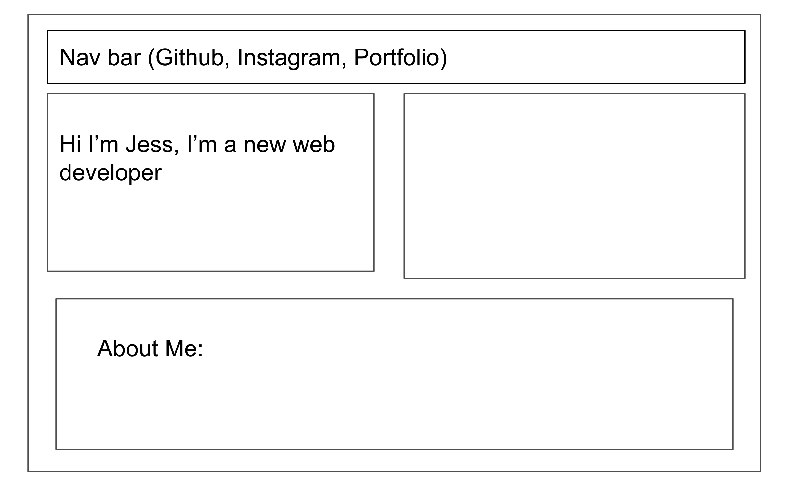
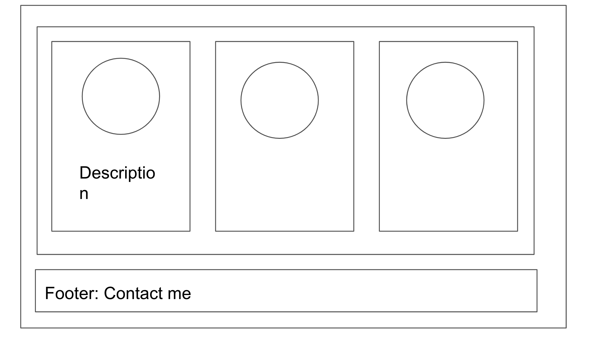

# Unit-8-Updated portfolio

# Description

To view the code on my github go to this [ link ](https://github.com/Key16/Unit-8-Updated-Portfolio/ )

Or view it live [ here ](https://key16.github.io/Unit-8-Updated-Portfolio/ )

This portfolio has been updated to include a new CSS library, Materialize. The look of the projects layout has changed slightly, and a parallax div has been added in as well. A mobile friendly side bar has also been added in.

The content will show all the past projects that I have done during the course of the last 2 months. 

The Other projects section is also a flex box and will stretch and wrap depending on which device you view. The circles of the projects will direct you to the image source as well in a new tab. 

The footer contains ways to contact me, in the form of image logos that will redirect you to placeholder social media links. This is also a flex box and will wrap into two rows on mobile. 

## Wireframe

